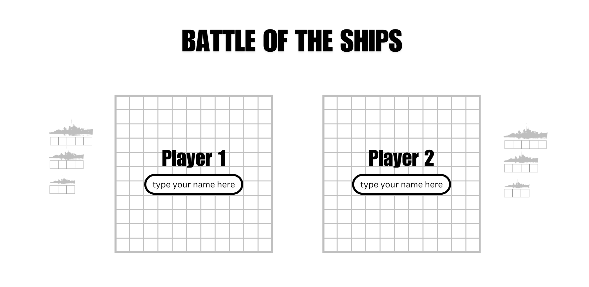
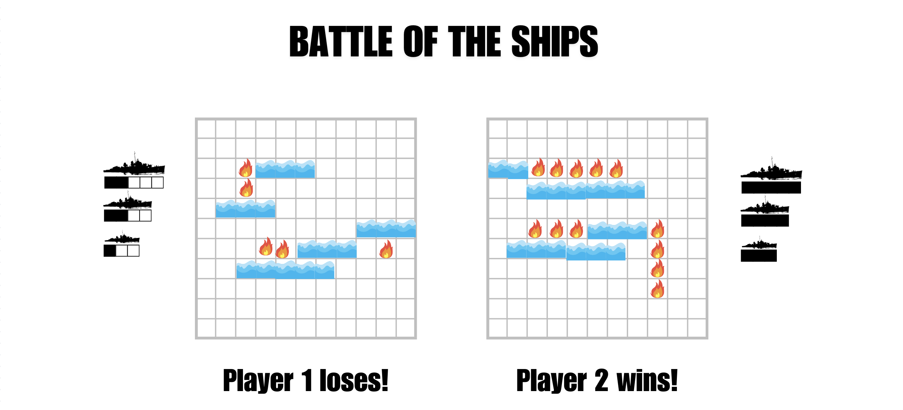

# Battle of the Ships

## Project Description
My game is called Battle of the Ships. This is a two-player game. The objective is to sink your opponent's ships before they sink yours. While there are instructions on how to play the game, the intention is to make the game as visually intuitive as possible, so that the interface is clean, clear, and efficient.

## Wireframe
Initial Landing View




Results View



## MVP User stories:
- As a user, I can start a game, so that I can read the rules before I start.
- As a user, I can see my grid and squares that represent the boats that I will be defending on my screen.
- As a user, I can see a blank grid that represents my opponents screen so that I can shoot.
- As a user, I can see where my cursor is hovering on my opponents grid, so that I can click on the correct square.
- As a user, I can click on a square to represent a shot at my opponent, so that I can keep track of which squares I shot.
- As a user, I can see if a shot hit or miss, so that I can plan my next shot.
- As a user, I should not be able to click on an already-clicked square, so that I can keep track of which squares are no longer in play.
- As a user, I can continue my play if I hit a boat, so that I can keep shooting at my opponent's boats.
- As a user, I can see if a boat has been sunk, so that I can plan my next shot.
- As a user, I can see the quantity and size of my opponent's boats, so that I can keep track of my progress.

## Stretch Goals:
- As a user, I can forfeit a game, so that I can tell my opponent that I cannot or do not want to continue.
- As a user, I can hear if my shot hit or miss, so that I can be more entertained.
- As a user, I can pause a game, so that my opponent (or I, if my opponent pauses) can know that the other player is not currently playing.
- As a user, I can ask the game to come up with a different layout for my boats.
- As a user, I can create my own layout for my boats.
- As a user, I can change the win conditions of my game, so that I can increase or decrease the difficulty of the game.
  win conditions:
    1. First player to sink 1 ship wins.
    2. First player to sink all ships wins.
- As a user, I can change the play conditions of my game, so that I can increase or decrease the difficulty of the game.
  play conditions:
    1. set time limit per turn before forfeiting the turn
    2. set a limit on the number of turns before ending the game and deciding a winner
    3. set a time limit before ending the game and deciding a winner
    4. keep track of time/turns for me and my opponent

## Pseudocode:
```Javascript
init() = {
  gridOne = [FALSE 100x ]
  gridTwo = [FALSE 100x ]
  boatGridOne = createBoatGrid()
  boatGridTwo = createBoatGrid()
  win = false
  lose = false
  turn = playerOne
  render() 
// **stretch goal status**
  tie = TRUE
  winMode = all or one
  time = 0
  turnTimeLimit = TRUE and defaultTime or FALSE
  GameTimeLimit = TRUE and defaultTime or FALSE
  turnLimit = TRUE and defaultTurns or FALSE
}

render() {
  updateGrids()
  updateMessages()
}

updateGrids() {
  // loops through the gridOne and gridTwo arrays and uses DOM to update 
  // the grid that players see on the browser
}
updateMessages() {
  // tells the players whose turn it is, if anyone has won, if time has run out, or if turns have run out
}

createBoatGrid() {
  // place boats from largest to smallest in random locations
  // randomize orientation of the boat
  // randomize placement of first TRUE at no more than length - sizeOfBoat
    // IF horizontal
      // THEN IF next item is TRUE
      // THEN start over 
        // IF next item is FALSE 
        // THEN iterate remaining number of TRUE on that array
    // IF vertical
      // THEN IF next item is TRUE
      // THEN start over
        // IF next item is FALSE 
        // THEN iterate remaining number of TRUE on the remaining rows at the same j index. remaining rows is number of remaining TRUEs
}

handleClick() { 
  shootAtOpponent() 
  checkHitMiss() 
  checkWinner() 
  switchPlayer() 
  render() 
}

shootAtOpponent() {
  // place a true or false at some specific item in gridOne[i][j] or gridTwo[i][j]
}
checkHitMiss() 
  // IF hit
  //   THEN prompt [turn] to click another square and [turn] stays the same
  // ELSE miss()
checkWinner() 
  // IF gridOne = boatGridTwo
  //   THEN winner = true
  // return [turn]
switchPlayer() 
  // IF winner = true
  //   THEN return
  // ELSE IF turn = playerOne
  //   THEN turn = playerTwo
  // ELSE turn = playerOne
```

## Project Deliverables
1. code MVP HTML
- source grid status images
- source cell states images
- source boat status images
- write game rules
- grid & flexbox
2. code MVP css
- color
- font sizes
- win/loss/tie animations
3. code MVP big functions
- code createBoatGrid
- code checkHitMiss
- code init as an object
4. code MVP small functions
- code render
- code updateGrids
- code updateMessages
- code shootAtOpponent
- code checkWiner
- code switchPlayer
- code render
5. Stretch Goals Phase 1
- source sounds for hit/miss
- attach sounds to event listeners
- code re-randomize boats button
- code exit/quit game status
- code pause game status
6. Stretch Goals Phase 2
- code create my own boat layout
- source boat layout status images
7. Stretch Goals Phase 3
- code win conditions for all or one boat
- code number of turns condition 
8. Stretch Goals Phase 4
- code game time limit condition
- code turn time limit condition

## Timeline

| Task | Priority | Deadline |
|---|---|---|
| code MVP HTML | must | Monday |
| code MVP css | must | Monday |
| code MVP big functions | must | Tuesday |
| code MVP small functions | must | Tuesday |
| Phase 1 | stretch | Wednesday |
| Phase 2 | stretch | Thursday |
| Phase 3 | stretch | Friday |
| Phase 4 | stretch | Sunday |
