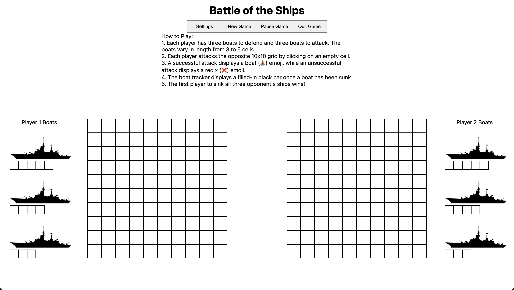

# Battle of the Ships

## Game Descrition
This is a browser-based version of Battleship. This version, also known as Battle of the Ships, is a two-player game. The objective is to sink your opponent's ships before they sink yours. In the original version of Battleship, each player places their own ships onto the grid and keeps track of the shots that their opponent has taken. In this online version, each player does not know where their own boats are either, adding to the suspense of who will prevail in this battle.

## Getting Started
Click [here](https://version-2--battle-of-the-ships.netlify.app/) to get started with the game!

Click [here](./PROPOSAL.md) to access the planning materials and proposal.

## Attributions

Click [here](https://t3.ftcdn.net/jpg/06/84/62/38/360_F_684623836_9i23UJZfuWBhjS49vQpwGcEc22p3XTaS.jpg) to see the link I used for the boats.

Click [here](https://e7.pngegg.com/pngimages/197/305/png-clipart-computer-icons-airport-surveillance-radar-air-traffic-control-effective-miscellaneous-company.png) to see the link I used for the green radar.

Click [here](https://freesound.org/) to see the link I used for the sounds.

## Technologies Used

In this project, I used HTML, CSS, and Javascript to write the game.

## Next Steps

Some future updates of the game will include the following features:

1. Allow a player to place their own boats to reduce gamer anxiety.
2. Change the win condition from sinking all boats first to sinking any boat first.
3. Change the play conditions by limiting the amount of time each player gets in total, for each turn, or for each turn and in total.
4. Change the play conditions by limiting the number of turns each player gets.
5. Change the boat tracker to keep track of each boat's sink-state at the cell-level as opposed to the boat-level.